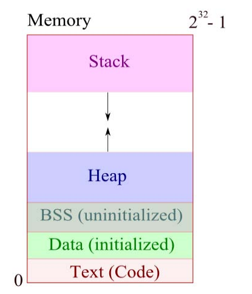

# C memory management

## Heap 
Heap is a chunk of memory that users can use to dynamically allocated memory

## Stack

• Stack contains local variables from functions and
related book-keeping data. LIFO structure
Function variables are pushed onto stack when
called.
Functions variables are popped off stack when
return.



## Dynamic Allocation 

- sizeof(a c language keyword) returns number of bytes of a data type
- malloc/realloc finds a specified amout of free memory and returns a void pointer to it
```cpp
▫ char * str = (char *) malloc( 3 * sizeof(char) );
strcpy(str, “hi”);
▫ str = (char *) realloc( str , 6 * sizeof(char) );

strcpy(str, “hello”);
```
## Dynamic deallocation

- free declares the memory pointed to by a pointer variable as free for future use:
```cpp
char * str = (char *) malloc( 3 * sizeof(char) );

strcpy(str, “hi”);

... use str ...

free(str);
```
### Dynamically Allocated Arrays 
- Allows you to avoid declaring array size at declaration.
- Use malloc to allocate memory for array when needed:
  
```cpp
int *dynamic_array;
dynamic_array = malloc( sizeof( int ) * 10 );
dynamic_array[0]=1; // now points to an array 
```

## Summary

- Memory has stack and heap.
• Pointers and addresses access memory.
• Arrays are really chunks of memory. Strings are
null-terminated char arrays.
• C allows user memory allocation. Use malloc,realloc and free.