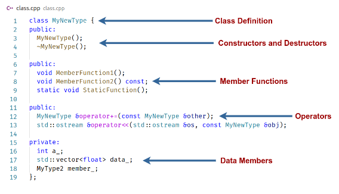

# C++ Classes


- Classes are used to encapsulate data along with methods to process them
- Every class or struct defines a new type
- Terminology:
  - Type or class to talk about the defined type
  - A variable of such type is an instance of class or an object
- Classes allow C++ to be used as an OOP language
- string,vector,etc. are all classes




## Classes Syntax
- Definition starts with the keyword class
- Classes have three acces modifiers:
  - private,protected and public
- By default everything is private
- Classes can contain data and functions
- Acces members with a "."
- Have two types of special functions
  - Constructors: called creation of an instance of class
  - Destructor : called upon destruction of an instance of the class
- google-style use CamelCase for class name
  
## What about structs?
- Definition starts with the keyword struct:
  
```cpp
struct ExampleStruct {
    Type value;
}
```

- struct is a class where everyting is public
- Google-Style use struct as a simple data container , if it needs a function it should be a class instead


